# C4 — System context

The `eco-comparator-bff` is a Node.js + Express 5 backend-for-frontend dedicated exclusively to
`eco-comparator-web`. It serves view-shaped endpoints and owns the OpenAPI contract.

**Rule:** the web talks **only** to the BFF, over relative `/api/v1/*` calls on the same origin with
the session cookie. It never calls downstream services, and never sees their tokens. The BFF is the
web's only client; the BFF owns every external integration (all of them start as mocks,
`PROVIDERS_DEFAULT=mock`).

```mermaid
C4Context
  title System context — eco-comparator-bff

  Person(analyst, "Analyst creator", "Prepares analyses, edits values, publishes reports")
  Person(explorer, "Explorer (viewer / integral)", "Reads published analyses, dashboards and exports")
  Person(executive, "Executive (viewer / integral)", "Consumes presentations; integral comments and requests changes")
  Person(admin, "Functional admin", "Users, roles, sources and parameters (admin flag)")

  System_Boundary(bff, "eco-comparator-bff — Node.js + Express 5") {
    System(bff_app, "BFF app", "View composition, derivations, authorization, orchestration")
  }

  System_Ext(entra, "Microsoft Entra ID + Graph", "SSO OIDC / OAuth2, group-to-role mapping (target)")
  System_Ext(lakebase, "Lakebase (PostgreSQL)", "Transactional authority: drafts, comments, change requests, saved views, RBAC (target)")
  System_Ext(sqlwh, "Databricks SQL Warehouse", "Read-only analytics over Gold and authorized Silver views (target)")
  System_Ext(vector, "Mosaic AI Vector Search", "RAG search with BFF-derived ACL filters (target)")
  System_Ext(volumes, "Unity Catalog Volumes / ADLS Gen2", "Source files and published artefacts (PPTX, PDF) (target)")
  System_Ext(llm, "Model Serving / Azure AI Foundry", "LLM for storytelling, variation explanations and the assistant (target)")
  System_Ext(jobs, "Databricks Jobs / Workflows API", "Ingestion, calculation engine, cascade recalculation, export rendering (target)")
  System_Ext(vault, "Azure Key Vault / Secret Scopes", "Secrets (target)")
  System_Ext(market, "S&P Capital IQ, Bloomberg", "External market and financial data APIs (target)")
  System_Ext(internal, "Hyperion, Artemisa, SharePoint", "Internal Ecopetrol systems (target)")

  Rel(analyst, bff_app, "Uses", "HTTPS, browser")
  Rel(explorer, bff_app, "Uses", "HTTPS, browser")
  Rel(executive, bff_app, "Uses", "HTTPS, browser")
  Rel(admin, bff_app, "Uses", "HTTPS, browser")

  Rel(bff_app, entra, "Signs users in, reads groups", "OIDC code + PKCE (target)")
  Rel(bff_app, lakebase, "Reads / writes transactional data", "PostgreSQL (target)")
  Rel(bff_app, sqlwh, "Runs analytical reads", "SQL, OAuth M2M (target)")
  Rel(bff_app, vector, "Semantic search", "HTTPS (target)")
  Rel(bff_app, volumes, "Reads sources, stores and streams artefacts", "HTTPS (target)")
  Rel(bff_app, llm, "Generates narratives and assistant answers", "HTTPS (target)")
  Rel(bff_app, jobs, "Starts jobs, follows job_id", "REST (target)")
  Rel(bff_app, vault, "Reads secrets", "HTTPS (target)")
  Rel(bff_app, market, "Fetches market data", "HTTPS (target)")
  Rel(bff_app, internal, "Reads internal data", "HTTPS (target)")

  UpdateLayoutConfig($c4ShapeInRow="4", $c4BoundaryInRow="1")
```

| Knows | `eco-comparator-bff` |
| --- | --- |
| Purpose | Serve those screens, and nothing else |
| Knows about | The contract and every external service |
| Business logic | Aggregation, derivations, authorization, orchestration |
| Downstream tokens and secrets | Holds and uses them |

Related documents: `docs/architecture/c4-containers.md` (layers of the BFF app), `docs/requirements/view-data-contracts.md`
(the contract the web consumes), `docs/architecture/adr/0002-contract-publication.md` (how the BFF publishes it).
